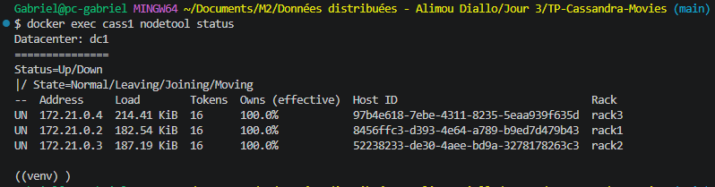
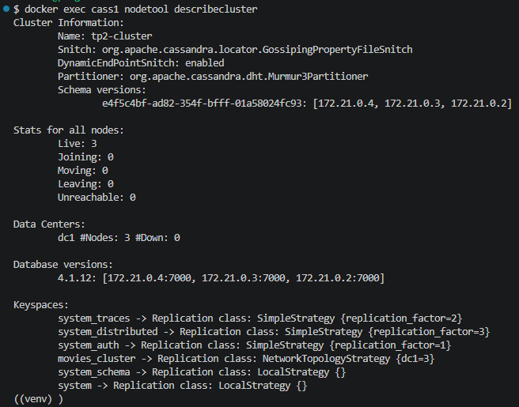
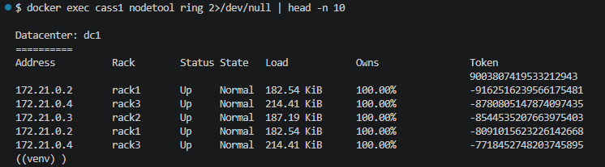
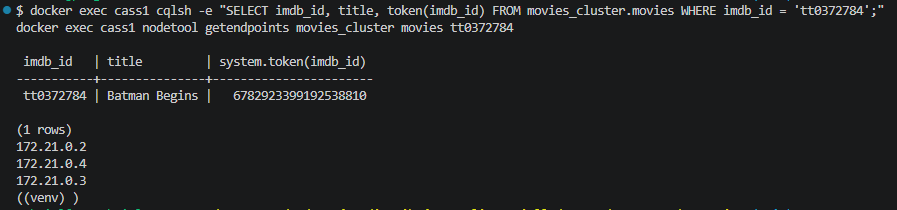
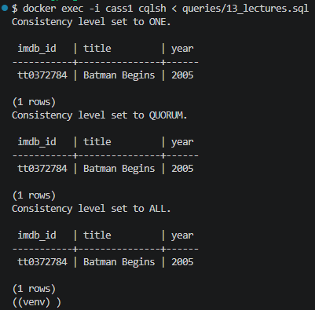
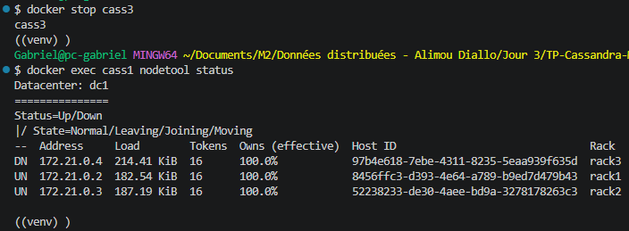
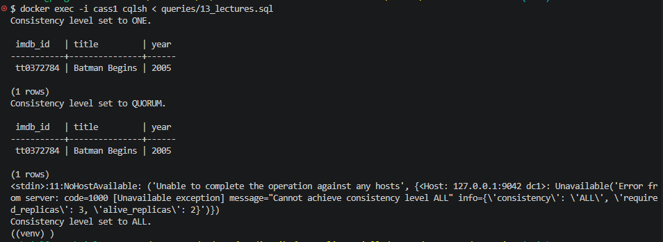
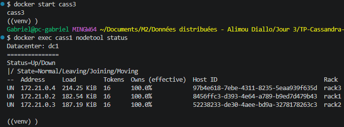

# Compte-rendu : cluster Cassandra, réplication et tolérance aux pannes

Sujet : films OMDb (table métier du TP2).

## 1. Architecture du cluster

Cluster `tp2-cluster` de 3 nœuds Docker, dans le datacenter `dc1` :

| Nœud | Adresse | Rack |
|---|---|---|
| `cass1` | 172.21.0.2 | rack1 |
| `cass2` | 172.21.0.3 | rack2 |
| `cass3` | 172.21.0.4 | rack3 |

Les nœuds ont été démarrés progressivement : `cass1` et `cass2`, puis `cass3`
une fois les deux premiers en état `UN`. Seul `cass1` expose le port 9042 vers
la machine hôte.



### Question 1 : état après le démarrage des trois nœuds

- Nombre de nœuds : **3**.
- État : **`UN`** (Up / Normal) pour les trois.
- Datacenter : **`dc1`** pour les trois.
- Racks : **`rack1`**, **`rack2`** et **`rack3`**, un par nœud.

## 2. Vérification du cluster

`nodetool describecluster` indique :

- nom du cluster : `tp2-cluster` ;
- snitch : `GossipingPropertyFileSnitch` ;
- partitionneur : `Murmur3Partitioner` ;
- 3 nœuds `Live`, aucun `Joining`, `Leaving` ni `Unreachable` ;
- une seule version de schéma partagée par les 3 nœuds ;
- keyspace `movies_cluster` : `NetworkTopologyStrategy {dc1=3}`.

### Question 2 : architecture et vocabulaire

| Terme | Définition |
|---|---|
| **Node** | une instance Cassandra (ici un conteneur : `cass1`, `cass2`, `cass3`) |
| **Rack** | regroupement logique de nœuds, qui représente une baie ou une zone de panne. Cassandra s'en sert pour répartir les réplicas |
| **Datacenter** | regroupement logique de racks, en général un site géographique (ici `dc1`) |
| **Cluster** | l'ensemble des nœuds qui partagent le même nom et le même schéma (ici `tp2-cluster`) |

Hiérarchie : un cluster contient des datacenters, un datacenter contient des
racks, un rack contient des nœuds.

## 3. Table métier

Les données OMDb sont celles du TP2, importées avec `script/import_movies.py`
(100 films). La table de référence du TP2 a été reprise dans le keyspace du
cluster.

### Question 3

- Keyspace : `movies_cluster`.
- Table : `movies`.
- Colonnes : `imdb_id`, `title`, `year`, `runtime`, `genres`, `directors`,
  `countries`, `imdb_rating`, `imdb_votes`.
- **Partition key** : `imdb_id`.
- **Clustering key** : aucune, car une partition contient une seule ligne
  (un film par `imdb_id`).

Seule la table de référence est présente dans le cluster. Les cinq tables par
besoin du TP2 ne sont pas reprises, car le TP porte sur la réplication, pas sur
la modélisation.

## 4. Réplication

```sql
CREATE KEYSPACE movies_cluster
WITH replication = {'class': 'NetworkTopologyStrategy', 'dc1': 3};
```

### Question 4 : RF = 3, partitionnement et réplication

**RF = 3** signifie que chaque partition est stockée en **3 exemplaires**,
sur 3 nœuds différents. Avec 3 nœuds, chaque film est donc présent sur
`cass1`, `cass2` et `cass3`. C'est pourquoi `Owns` est à 100 % pour chaque nœud.

- **Partitionnement** : répartir les partitions entre les nœuds. La clé de
  partition est hachée en un token, et ce token désigne le nœud principal.
- **Réplication** : copier chaque partition sur plusieurs nœuds, pour
  résister à une panne.

Le partitionnement décide *où va* une donnée, la réplication décide *combien
de copies* existent.

## 5. Distribution

`nodetool describecluster` et `nodetool ring` montrent le cluster, ses 3 nœuds
et leurs tokens : chaque nœud possède 16 tokens répartis sur l'anneau,
mélangés entre `rack1`, `rack2` et `rack3`.





### Question 5 : chemin d'une donnée

Exemple avec le film `tt0372784` (*Batman Begins*) :

```text
Partition key : imdb_id = 'tt0372784'
      ↓
Hash (Murmur3Partitioner)
      ↓
Token : 6782923399192538810
      ↓
Nœud responsable : le nœud dont les tokens couvrent cette valeur
      ↓
Réplicas : 172.21.0.2 (cass1, rack1), 172.21.0.4 (cass3, rack3)
           et 172.21.0.3 (cass2, rack2)
```

Le coordinateur calcule le token de la clé avec Murmur3, puis cherche sur
l'anneau le nœud propriétaire de ce token. Les réplicas suivants sont les
nœuds suivants sur l'anneau, en choisissant des racks différents (ici
`rack1`, `rack3`, `rack2`). Avec RF = 3 et 3 nœuds, les 3 nœuds reçoivent
la donnée.

`nodetool getendpoints` confirme que le film est stocké sur les trois nœuds.



## 6. Niveaux de cohérence (3 nœuds actifs)

Lecture du film `tt0372784` en `ONE`, `QUORUM` et `ALL` : les trois réussissent
(`Batman Begins`, 2005).



### Question 6 : comparaison

| Niveau | Réplicas nécessaires (RF = 3) | Garantie | Disponibilité |
|---|---:|---|---|
| ONE | 1 | la réponse d'un seul réplica, possiblement en retard | la plus élevée : survit à 2 pannes |
| QUORUM | 2 (majorité) | lecture cohérente si l'écriture était aussi en QUORUM | survit à 1 panne |
| ALL | 3 | tous les réplicas ont répondu | la plus faible : échoue dès qu'un nœud manque |

Plus le niveau est strict, plus la cohérence est forte, et moins le cluster
tolère de pannes.

## 7. Panne de cass3

```bash
docker stop cass3
docker exec cass1 nodetool status
```



### Question 7

`cass3` (`172.21.0.4`, `rack3`) est en état **`DN`** (Down / Normal). Il reste
**2 nœuds disponibles** sur 3 : `cass1` et `cass2`, en `UN`.

La colonne `Owns` reste à 100 % pour `cass3` : elle indique la part de données
que le nœud doit posséder, pas ce qu'il peut servir.

## 8. Lectures pendant la panne

| Niveau | Résultat |
|---|---|
| ONE | succès |
| QUORUM | succès |
| ALL | échec : `Cannot achieve consistency level ALL` (`required_replicas: 3`, `alive_replicas: 2`) |



### Question 8

- `ONE` demande 1 réplica et `QUORUM` en demande 2 : avec 2 nœuds vivants,
  les deux sont possibles.
- `ALL` en demande 3 : il n'y en a plus que 2, donc Cassandra refuse la
  lecture par une `UnavailableException`, sans même la tenter.

Règle : une opération réussit si **nombre de réplicas vivants ≥ réplicas
exigés par le niveau**. `RF = 3` fournit 3 copies, ce qui laisse de la marge :
`QUORUM` tolère 1 panne, `ONE` en tolère 2.

L'écriture du TP précédent (film `tt9999999` en `QUORUM` pendant la panne) a
aussi réussi, pour la même raison.

## 9. Redémarrage de cass3

```bash
docker start cass3
docker exec cass1 nodetool status
```



### Question 9

`cass3` **revient dans le cluster** et repasse en état **`UN`** (Up / Normal),
avec ses 16 tokens et son rack `rack3`. Il a fallu attendre quelques dizaines
de secondes avant que les trois nœuds soient de nouveau `UN`.

## 10. Vérification après le retour

Les trois lectures (`ONE`, `QUORUM`, `ALL`) réussissent à nouveau sur
`tt0372784`. `ALL` n'aboutit que si les 3 réplicas répondent : cela confirme
que `cass3` est de nouveau complètement intégré.

Dans le TP précédent, le film `tt9999999`, écrit pendant la panne, a aussi été
retrouvé en lisant directement sur `cass3` en `ONE`.


### Question 10

```text
Donnée (film)
   ↓
Partition (clé imdb_id, hachée en token)
   ↓
Réplication (copie sur les 3 nœuds)
   ↓
Panne de cass3 : 2 copies restent disponibles
   ↓
Données toujours accessibles (ONE, QUORUM)
   ↓
Retour de cass3 : il retrouve son état et les écritures manquées
```

Pendant la panne, les nœuds vivants conservent les écritures destinées à
`cass3` (hinted handoff) et les lui rejouent à son retour.

## 11. Synthèse

```text
3 nœuds → RF = 3 → données répliquées sur les 3 nœuds
→ arrêt de cass3 → 2 nœuds disponibles
→ ONE et QUORUM fonctionnent, ALL échoue
→ redémarrage de cass3 → retour en UN
→ les trois niveaux fonctionnent à nouveau
```

### Question 11 : pourquoi la réplication permet de continuer

Chaque partition existe en trois exemplaires. Quand un nœud tombe, deux copies
restent, donc la donnée n'est pas perdue et peut encore être lue ou écrite à
condition que le niveau de cohérence demandé soit compatible avec le nombre de
réplicas vivants. Il n'y a pas de point de défaillance unique : n'importe quel
nœud peut jouer le rôle de coordinateur. La réplication échange du stockage et
de la latence d'écriture contre de la disponibilité.

## Limites

- Les trois nœuds tournent sur une seule machine : une vraie panne toucherait
  un serveur entier.
- Le jeu de données est petit (100 films).
- Le cas d'une panne de deux nœuds n'a pas été testé : seul `ONE` serait
  encore possible.