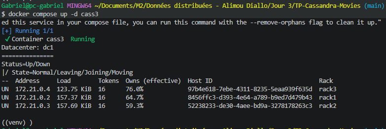
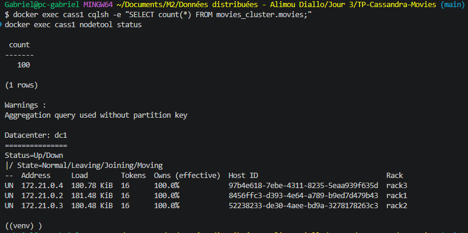
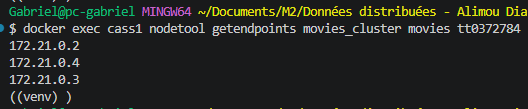
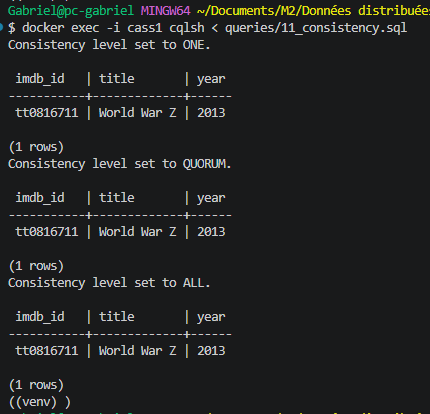
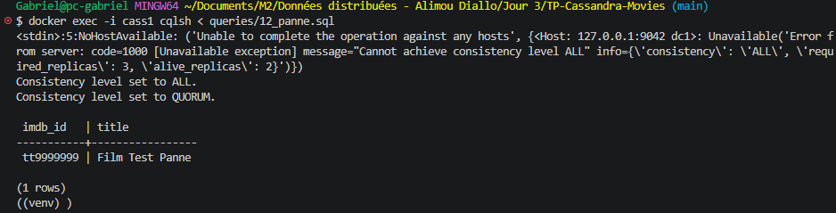
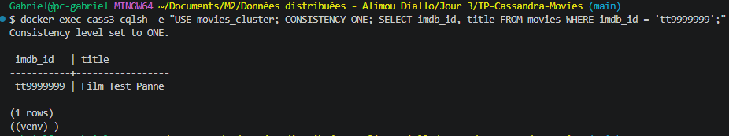

# Cluster Cassandra : réplication et pannes (données OMDb)

## Infrastructure

Cluster de 3 nœuds Docker (`cass1`, `cass2`, `cass3`), datacenter `dc1`,
un rack par nœud (`rack1`, `rack2`, `rack3`), 16 tokens par nœud.
Seul `cass1` expose le port 9042 vers la machine hôte : le script Python
s'y connecte et le coordinateur répartit ensuite les écritures.

## Keyspace et table

```sql
CREATE KEYSPACE movies_cluster
WITH replication = {'class': 'NetworkTopologyStrategy', 'dc1': 3};
```

- `NetworkTopologyStrategy` tient compte du datacenter et des racks.
- `dc1: 3` : chaque donnée est stockée sur les 3 nœuds. Avec RF = 3 et
  3 nœuds, `Owns` passe à 100 % partout.

Table `movies` : clé de partition `imdb_id`, sans clustering (une ligne par
film). Elle reprend le modèle de référence du TP précédent.

## Données

100 films OMDb, importés par `script/import_movies.py` (recherche par
mot-clé, puis détail par `imdbID`). Les écritures utilisent le niveau
`QUORUM`.

## Expériences

### Réplication

`nodetool getendpoints movies_cluster movies tt0372784` renvoie les 3
adresses IP : le film est présent sur les 3 nœuds.

### Niveaux de cohérence (3 nœuds actifs)

| Niveau | Réplicas requis | Résultat |
|---|---|---|
| ONE | 1 | succès |
| QUORUM | 2 (majorité de 3) | succès |
| ALL | 3 | succès |

### Panne de cass3

`docker stop cass3`, puis :

| Opération | Niveau | Résultat |
|---|---|---|
| Lecture | ALL | échec : `Cannot achieve consistency level ALL`, 3 réplicas requis, 2 vivants |
| Écriture du film `tt9999999` | QUORUM | succès : 2 réplicas sur 3 suffisent |
| Lecture du film `tt9999999` | QUORUM | succès |

### Rétablissement

`docker start cass3`, puis lecture directe sur `cass3` en `ONE` : le film
`tt9999999`, écrit pendant la panne, est présent. `cass3` l'a récupéré à son
retour grâce au **hinted handoff** : les nœuds vivants ont gardé l'écriture
manquée et l'ont rejouée sur `cass3`.

## Conclusions

- Avec RF = 3, le cluster supporte la perte d'un nœud pour les lectures et
  écritures en `QUORUM`.
- `ALL` privilégie la cohérence mais perd la disponibilité dès qu'un réplica
  manque.
- `ONE` est le plus disponible, mais peut lire une donnée en retard.
- `QUORUM` en lecture et en écriture donne un bon compromis : R + W > RF
  (2 + 2 > 3), donc une lecture voit toujours la dernière écriture.

## Limites

- Tout tourne sur une seule machine : une panne réelle serait un nœud
  physique, pas un conteneur.
- 100 films seulement, issus de 5 mots-clés.
- `count(*)` sans clé de partition génère un avertissement : acceptable
  uniquement sur un petit volume.
## Captures







